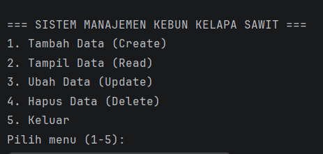
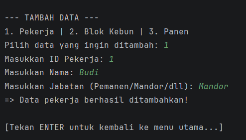
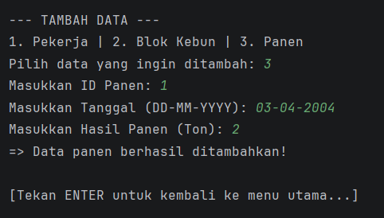
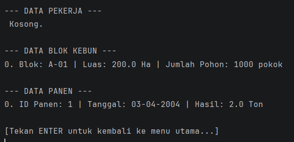
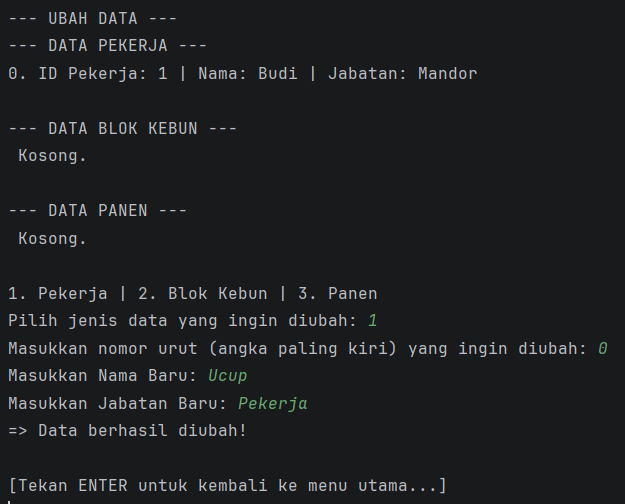
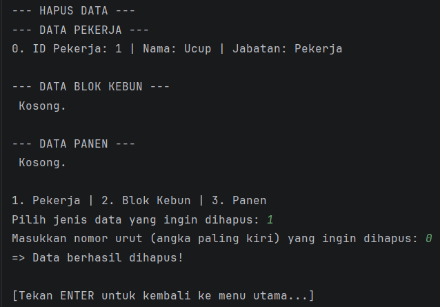

# 🌴 Sistem Manajemen Kebun Kelapa Sawit

Program sederhana berbasis Console/Terminal menggunakan Java untuk mengelola data operasional di perkebunan kelapa sawit. Program ini mengimplementasikan konsep dasar **OOP (Object-Oriented Programming)** dan operasi **CRUD (Create, Read, Update, Delete)** menggunakan `ArrayList`.

---

##Struktur Folder
Proyek ini memiliki struktur direktori sebagai berikut:
```text
├── asset/              # Folder untuk menyimpan gambar/screenshot output program
├── src/                # Folder berisi source code Java
│   ├── BlokKebun.java
│   ├── Main.java
│   ├── Panen.java
│   └── Pekerja.java
└── README.md           # File laporan
```

---

## Screenshot / Output Program

Berikut adalah cuplikan layar (screenshot) dari program saat dijalankan:

### 1. Tampilan Menu Utama
*(Menampilkan menu interaktif yang terus berulang)*


### 2. Tambah Data (Create)
*(Proses saat user memasukkan data baru ke dalam sistem)*

#### a. Tambah Data Pekerja


#### b. Tambah Data Blok Kebun


#### c. Tambah Data Panen


### 3. Tampil Data (Read)
*(Menampilkan daftar data yang sudah tersimpan di dalam ArrayList)*


### 4. Ubah Data (Update)
*(Proses mengubah data yang sudah ada berdasarkan nomor urut/indeks yang dipilih)*


### 5. Hapus Data (Delete)
*(Proses menghapus data dari sistem berdasarkan nomor urut/indeks)*


---

## Deskripsi Proyek
Proyek ini dibuat untuk menyimulasikan sistem pendataan di sebuah perkebunan kelapa sawit. Sistem ini dirancang agar sangat interaktif, dan memiliki tampilan terminal yang bersih (*Clean Console UI*). Program akan terus berjalan dalam sebuah *looping* (perulangan) hingga pengguna memilih menu "Keluar".

## Fitur Program
Program ini memiliki fitur utama CRUD:
1. **Create (Tambah Data)**: Memasukkan data baru (Pekerja, Blok Kebun, atau Panen).
2. **Read (Tampil Data)**: Menampilkan seluruh data beserta nomor indeksnya.
3. **Update (Ubah Data)**: Memperbarui data yang sudah ada berdasarkan nomor urut.
4. **Delete (Hapus Data)**: Menghapus data dari sistem berdasarkan nomor urut.
5. **Clear Screen**: Layar terminal akan otomatis dibersihkan setiap kali berpindah menu agar tampilan tetap rapi.

---

##  Struktur Class (Data yang Dikelola)

### 1. `Pekerja`
Digunakan untuk mencatat data sumber daya manusia (SDM).
*   **Atribut**: `ID Pekerja`, `Nama`, `Jabatan`.

### 2. `BlokKebun`
Digunakan untuk mendata pembagian area lahan kelapa sawit.
*   **Atribut**: `ID Blok`, `Luas (Hektar)`, `Jumlah Pohon`.

### 3. `Panen`
Digunakan untuk merekap hasil produksi buah sawit.
*   **Atribut**: `ID Panen`, `Tanggal`, `Total Hasil (Ton)`.

---

